# Joomla! Event Calendar

Event Calendar is a Joomla! component that helps you integrate the JavaScript event calendar [https://github.com/vkurko/calendar/](https://github.com/vkurko/calendar/) to your Joomla! website without writing JavaScript code.

## Technical Requirements

* Joomla! 5.x. See technical requirements for Joomla! 5.x [here](https://manual.joomla.org/docs/next/get-started/technical-requirements/#requirements-for-joomla-5x).

## Installation

* [Download the latest release](https://github.com/cmextension/joomla-event-calendar/releases)
* Install with Joomla!'s extension manager

## Configuration

### The component

In Joomla! back-end, navigate to `Components` -> `Event Calendar` -> `Calendar`, this page is the calendar for the administrators to manage the events, click `Options` button at the top right corner of the page to access the component's configuration.

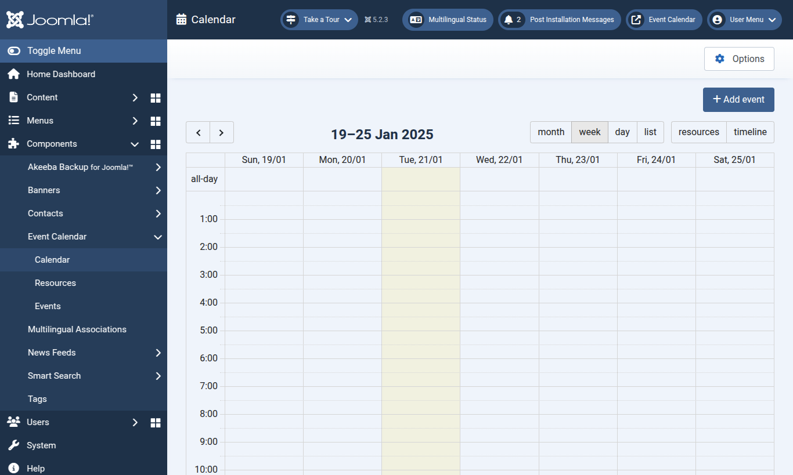

The configuration page contains 4 tabs: `Toolbar`, `View`, `Event` and `Permissions`.

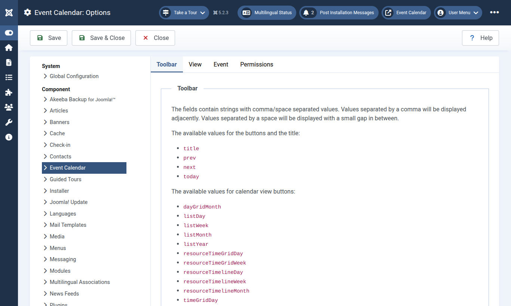

#### Toolbar configuration

The `Toolbar` tab has the options to configure the toolbars of the calendars on the admin side (back-end) and the user side (front-end).

The toolbar can show many components like the calendar's title and the navigation buttons at the left, center and the right side. The available components and the instruction how to configure them are shown at the top of the page.

At the bottom of the page, you can configure what components are shown for the calendars. If you want to have the same calendar to the [demo calendar](https://vkurko.github.io/calendar/), you can click the `Copy to the front-end calendar` and `Copy to the back-end calendar` buttons.

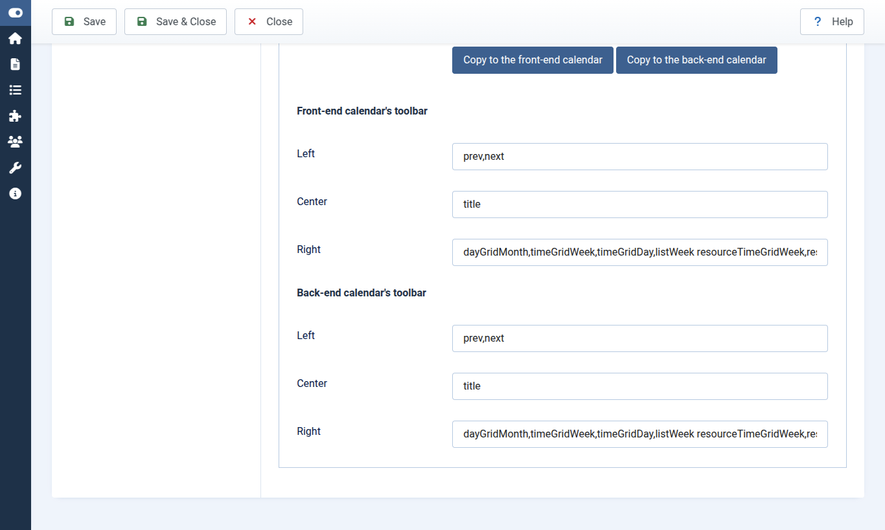

#### Default view

In the `View` tab, you can set the default view for the admin side's calendar and the user side's calendar.

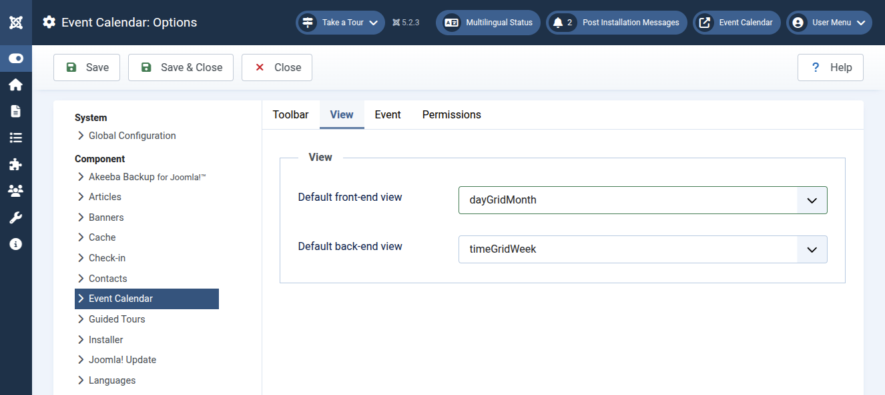

#### Event's link

An event can be clickable and opens a URL, you can configure to open event's links in the same browser tab or in a new tab in the `Event` tab.

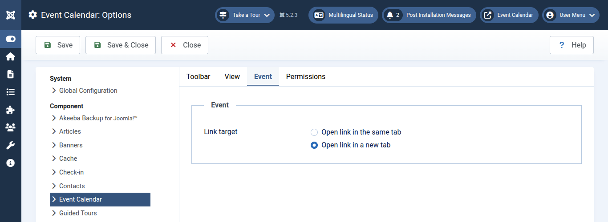

#### Permissions

The `Permissions` tab is where you configure the Access Control List for the component, you can allow or forbid the users in the available access levels from doing the core actions, like configuring the component, creating new record (event), etc... This is similar to configuring other core components in Joomla!. You can read more about Joomla!'s access control list [here](https://docs.joomla.org/J3.x:Access_Control_List_Tutorial).

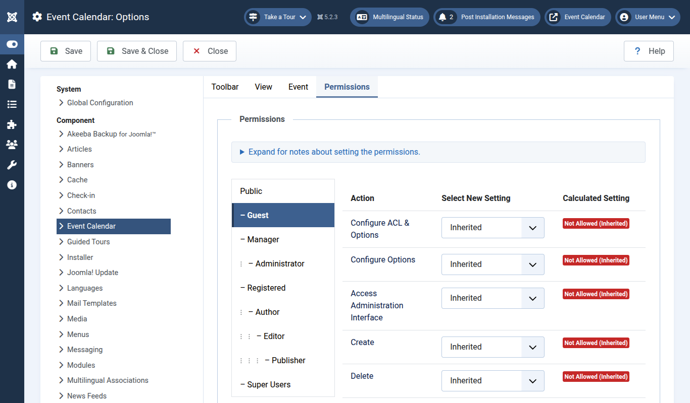

### Manage resources

To manage the calendars's resources, you go to `Components` -> `Event Calendar` -> `Resources`, this is the list of the created resources, you can create, edit and delete resources here.

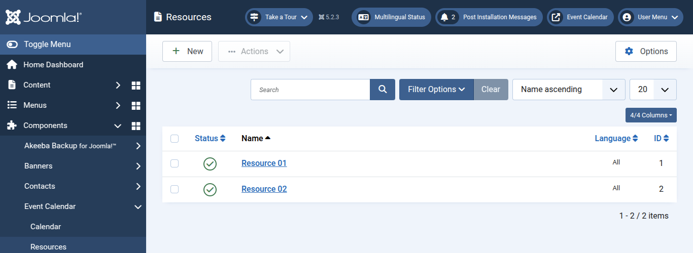

The resource form contains the following fields:

* **Name**: The resource's name.
* **Events**: You can assign events to the resource right from here, you can also do this on the event side.
* **Status**: The resource is published or not.
* **Language**: The language of the resource, you only need this if your site is multilingual.
* **Event's background color**: The background color of the resource's events in the calendar.
* **Event's text color**: The text color of the resource's events in the calendar.

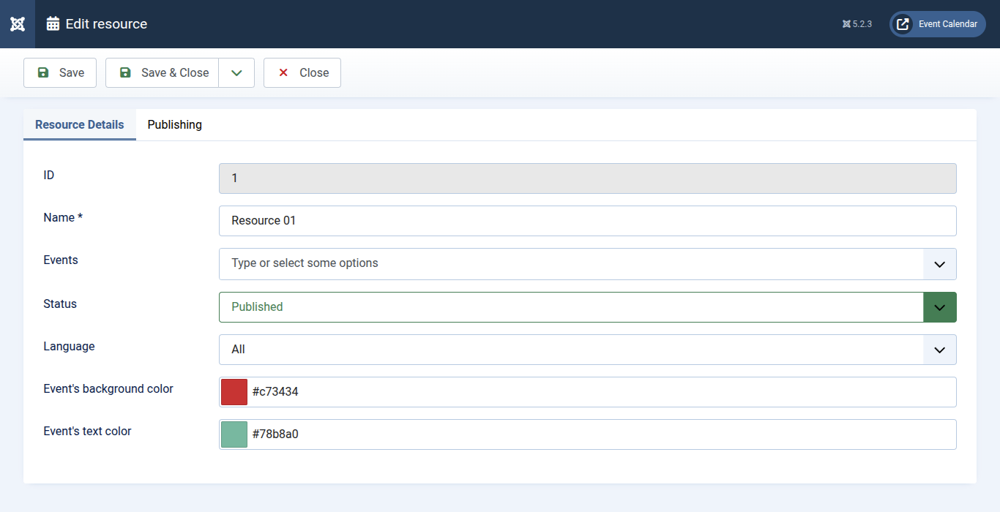

### Manage events

There are 2 ways to create a new event:

* From the `Calendar` page: Navigate to `Components` -> `Event Calendar` -> `Calendar`, click `Add event` button at the top right corner of the page, the event form is shown in the modal.
* From the `Events` page: Navigate to `Components` -> `Event Calendar` -> `Events`, click `New` button in the toolbar.

The `Events` page is all events are listed. You can click on event name to edit the event.

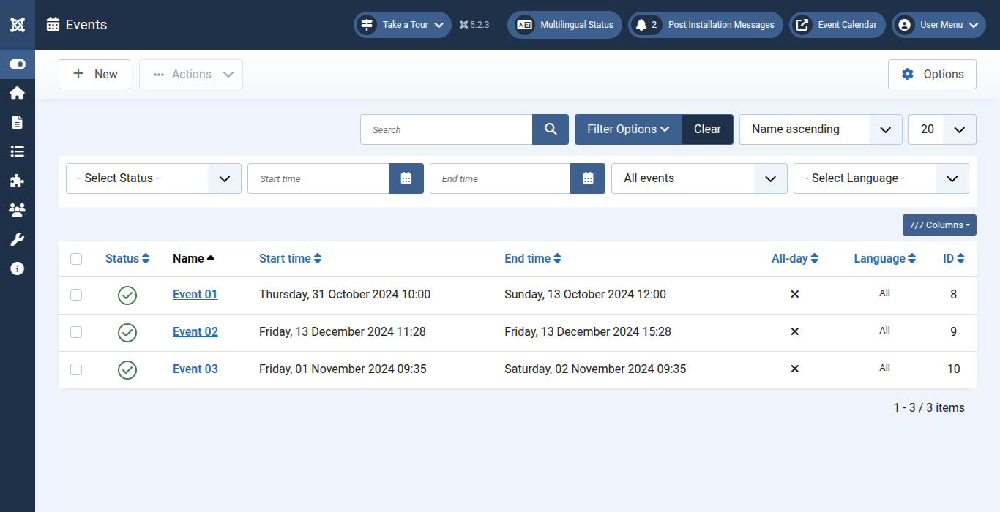

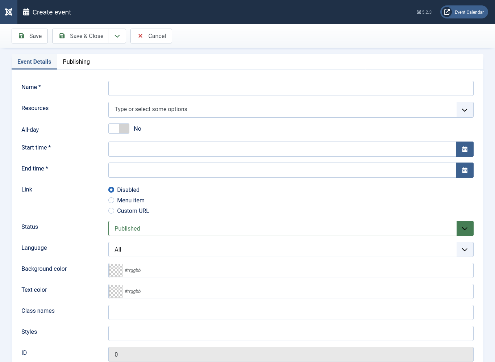

The fields in the event form are:

* **Name**: The event's name.
* **Resources**: The resources that the event belongs to.
* **All-day**: The event is an all-day event.
* **Start time**: The event's start time.
* **End time**: The event's end time.
* **Link**: Configure if the event is clickable and takes us to an internal page (menu item) or a URL.
* **Menu item**: Only shown if `Link` is `Menu item`. Select the menu item where we are taken to when we click the event.
* **URL**: Only shown if `Link` is `Custom URL`. Enter the URL where we are taken to when we click the event.
* **Status**: The event's status. Only published events are shown in the user side (front-end).
* **Language**: The event is only shown in the selected language.
* **Background color**: The background color of the event in the calendar.
* **Text color**: The color of the event in the calendar.
* **Class names**: Add custom CSS classes to the event, for example `sponsored-event all-day-event`. The CSS styles need to be defined somewhere else, like in your template's CSS files.
* **Styles**: Add custom CSS styles to the event, for example: `font-weight: bold;`

### Menu item

The component has only 1 menu item type `Event calendar`. This menu item type shows the calendar.

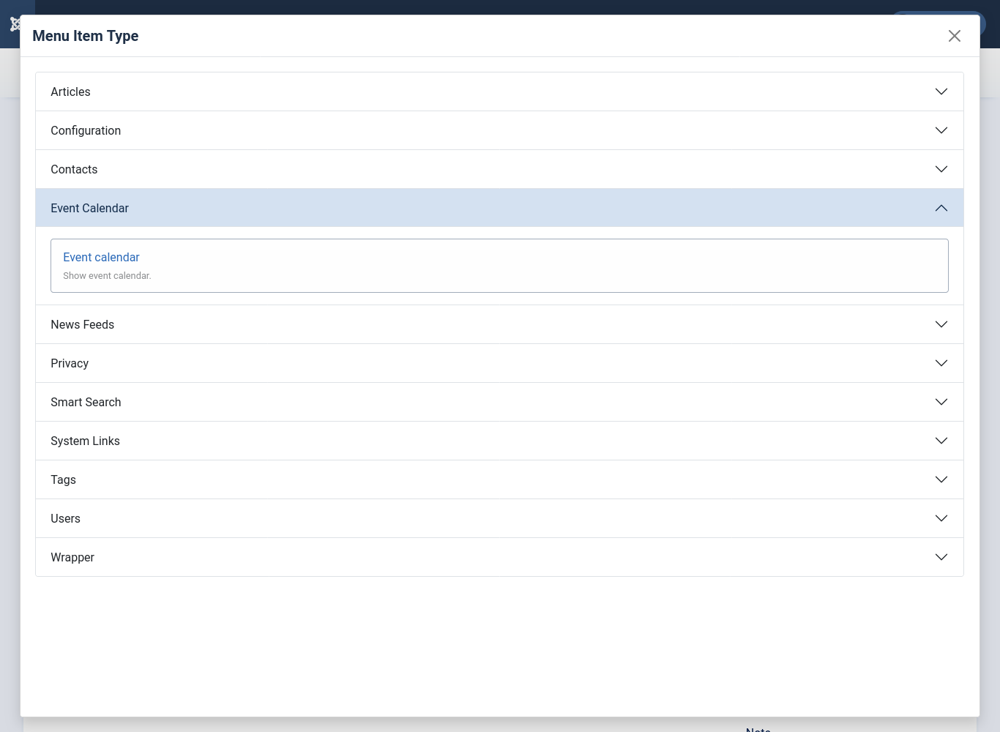

### Calendar module

Event Calendar has a module to show the calendar. The result calendar is the same to the calendar provided by the `Event calendar` menu item type. You can find this module in your module list by searching for `event calendar`.

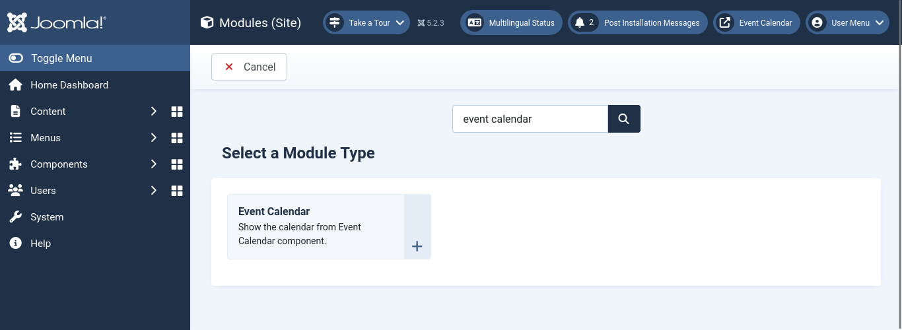

## License

GNU General Public License version 2 or later. See [LICENSE](LICENSE).